# DATALEUM-GROUP-6-POWERBI-PROJECT
This Project contains a PowerBi Project from Dataleum that was given to a team of 3 People. The Anlaysis of Optimus-Elite Superstore was done to help give valuable insights to make decisions. 
## Table of Content
1.0 - Introduction

2.0 - Data Sources

3.0 - Tools Used

4.0 - Data Transformation 

5.0 - Data Visualizations.

6.0 - Insights

7.0 - Recommendations

## 1.0 - Introduction
The Aim of the analysis aims to summarize the company's financial performance from 2011 to 2014. This analysis was done with the use of PowerBi to arrive at key buisness metrics to help drive decision making. 

## 2.0 - Data Source 
The Data Source for this Optimus-Elite Superstore was provided by Dataleum who gave us the project. The Dataset was given to my group in an Excel Format. 

## 3.0 - Tools Used
3.1 -**Microsoft Excel** [Download Here](www.microsoft.com)

3.2 -**Microsoft PowerPoint** [Download Here](https://www.microsoft.com/en-us/microsoft-365/powerpoint)

3.3 -**Microsoft PowerBi** [Download Here](https://app.powerbi.com/)

## 4.0 - Data Transformation
Using Microsoft Excel, we were able to check the data for any errors or any incomplete data that might be embedded in the dataset. We also used the PowerBi software to check our tables well and also created measures where necessary. After thorough cleaning, it was concluded that everything is clean and can be loaded for visualizations. 

## 5.0 - Data Visualization
With the data now loaded into Microsoft PowerBi, we were able to make some interesting visuals with the aid of the different charts available in the software. Some key insights gotten from the dataset would help to aid sales performance for the following year.
With the aid of some of the visuals we created, we were able to highlight some of the necessary key performance indicators that were needed to help improve sales for the next year. 

## 6.0 - Insights
There were some major insights gotten to help Optimus Elite Superstore improve sales for the next year. Some of the insights gotten include the following;
6.1 - *It showed the Total Revenue generated during the period of the four years amounted to 14.21M, while the Profit Generated amounted to 13.87M with a high Profit margin average of 95.64%.*

6.2 - *It showed that a total number of 6,033 items were sold and categories of products sold were 54 different items.*

6.3 - *It showed the Top 5 States by Profit were Yobe, Katsina, Ogun, Sokoto and Rivers. While the Bottom 5 states by Profit were Bauchi, Osun, Kebbi, Enugu and Delta.*

6.4 - *It showed that the regional manager with the highest number of sales was Northwest which was supervised by Zainab Abubakar, closely followed by Ifeoluwa Adeyemi of the North Central and amongst others.*

6.5 - *It showed a positive trend in the line chart as regards the sum of profit generated each year, saw it progressed from 2.4M in 2011 to 4.9M in 2014.*

6.6 - *It showed that the Consumer Segment recorded a higher sales of 49.09% which was closely followed by Corporate and Home Office* 

6.7 - *It showed that Phones and Medium both led in terms of profit when it comes to Sub-Category and Order Priority Level respectively. 

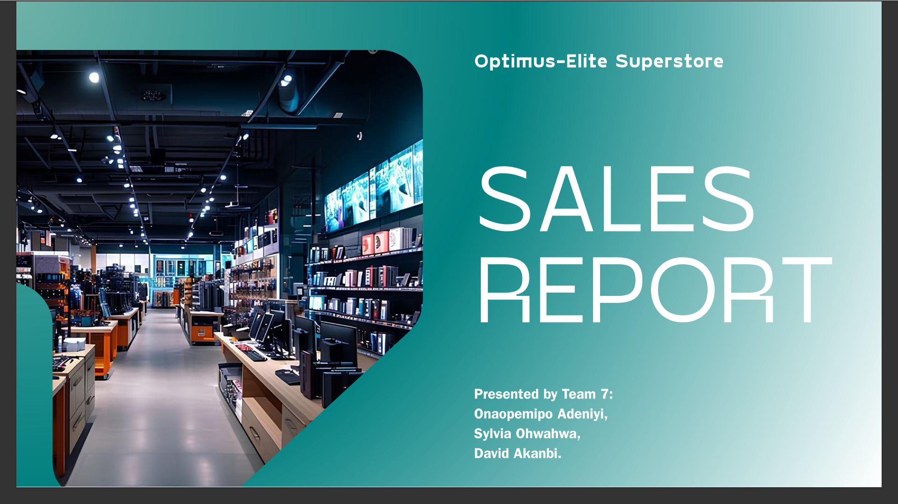

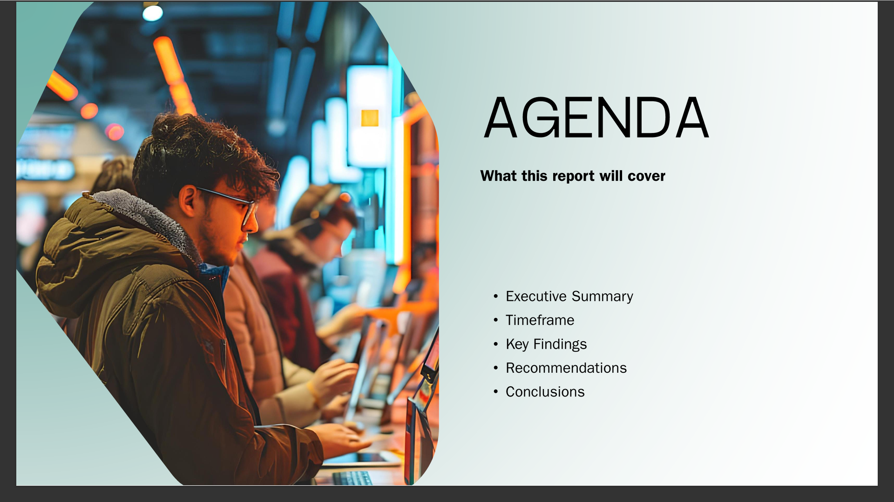

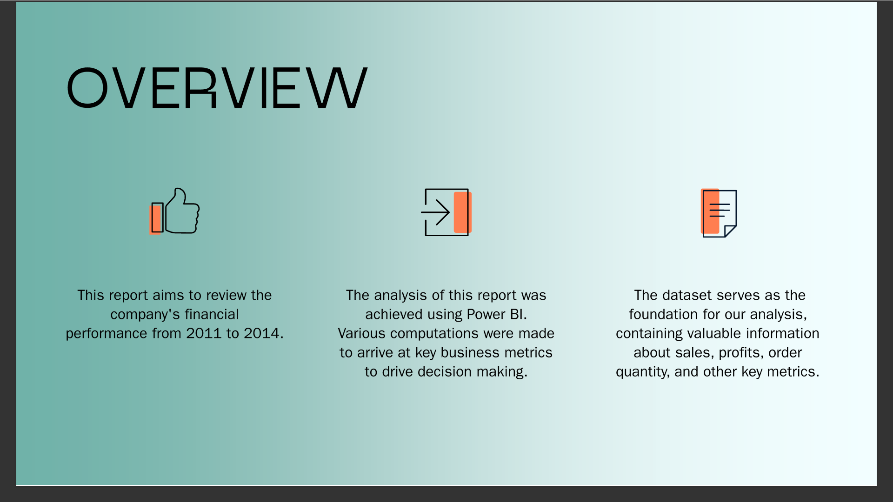

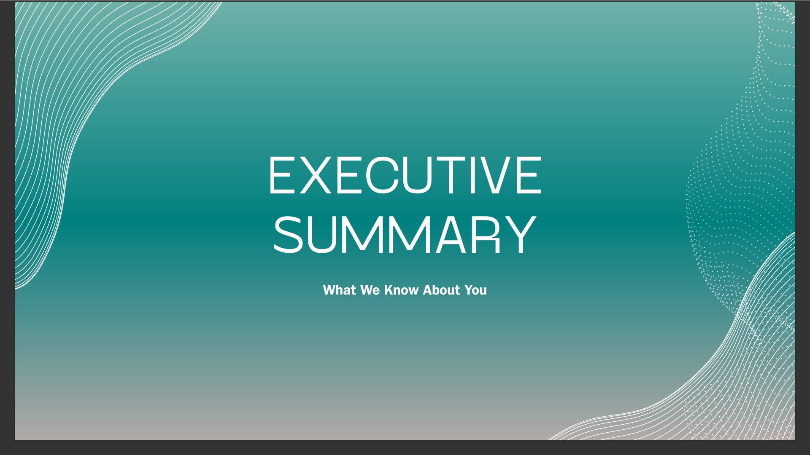

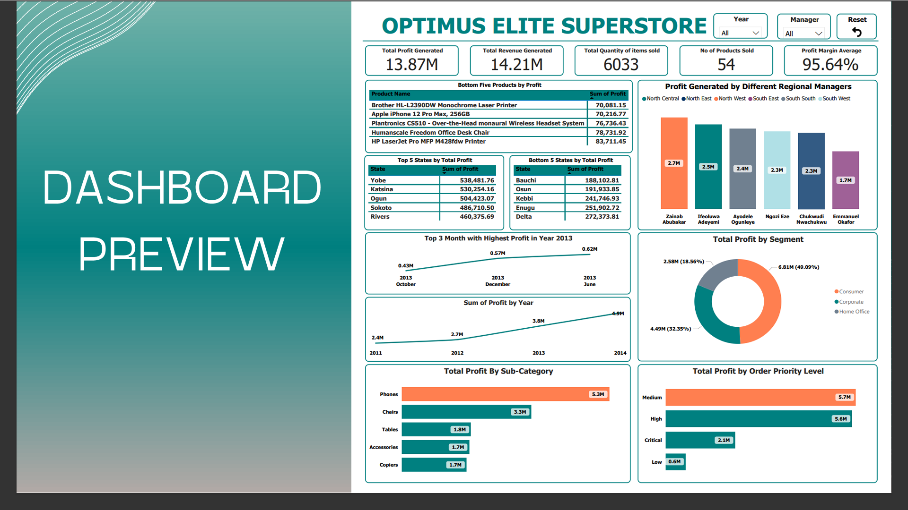

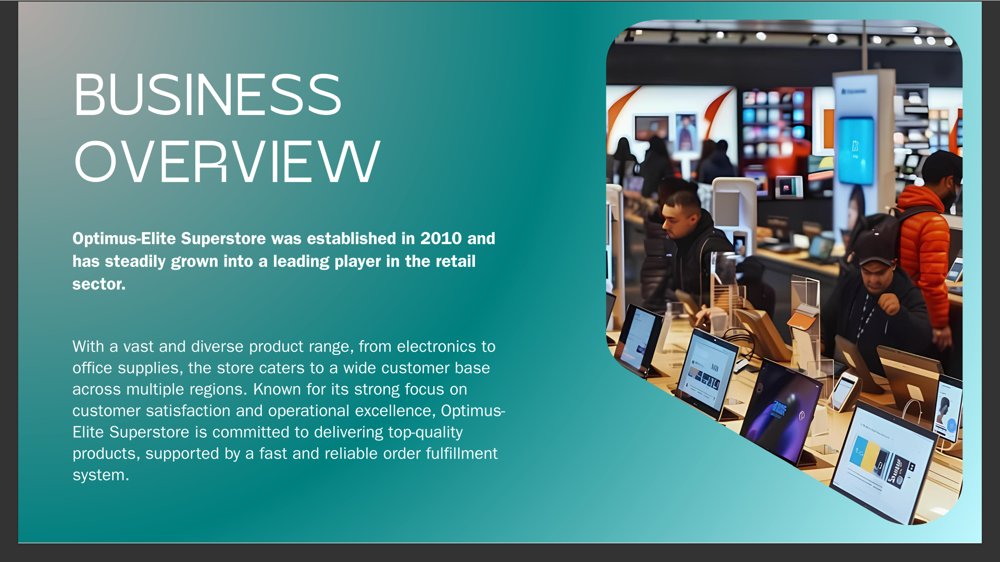

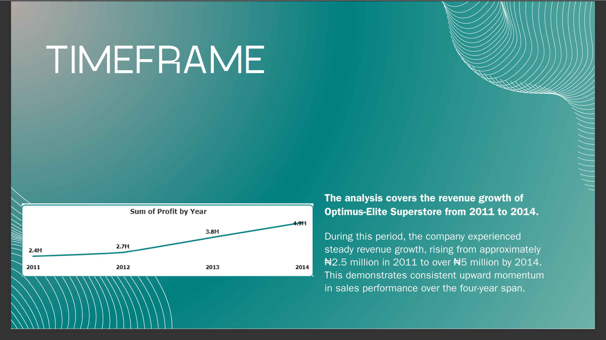

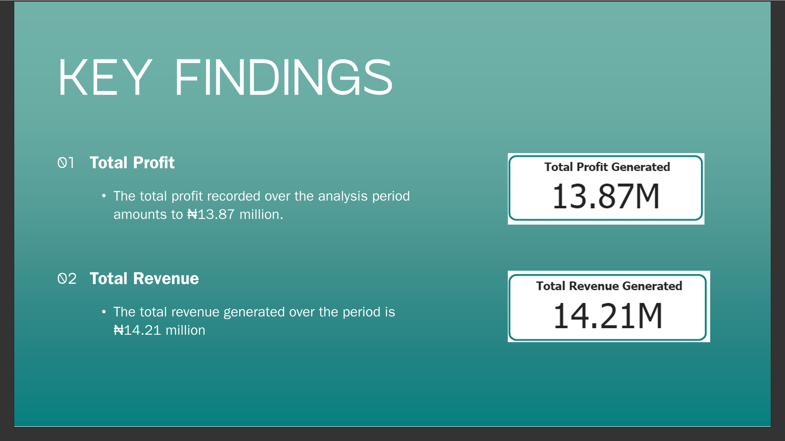

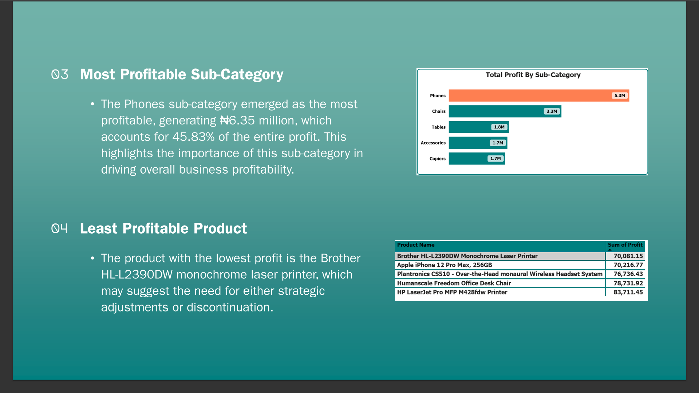

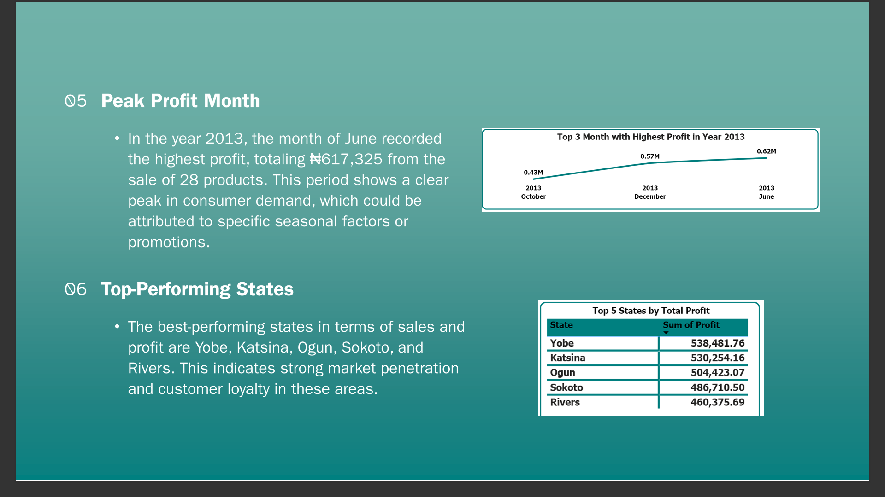

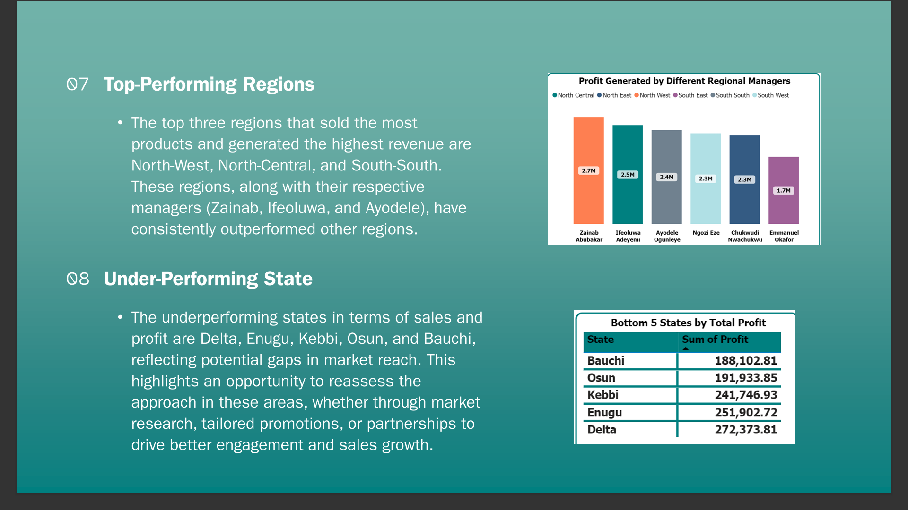

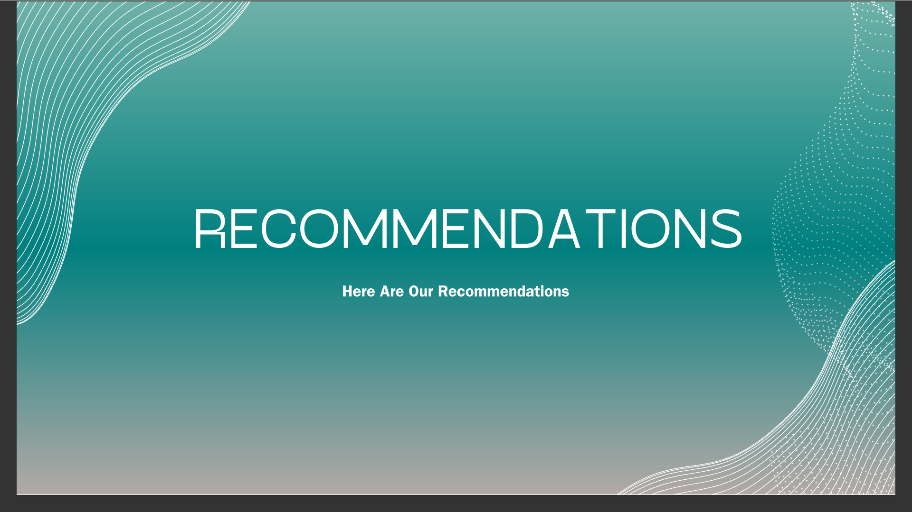

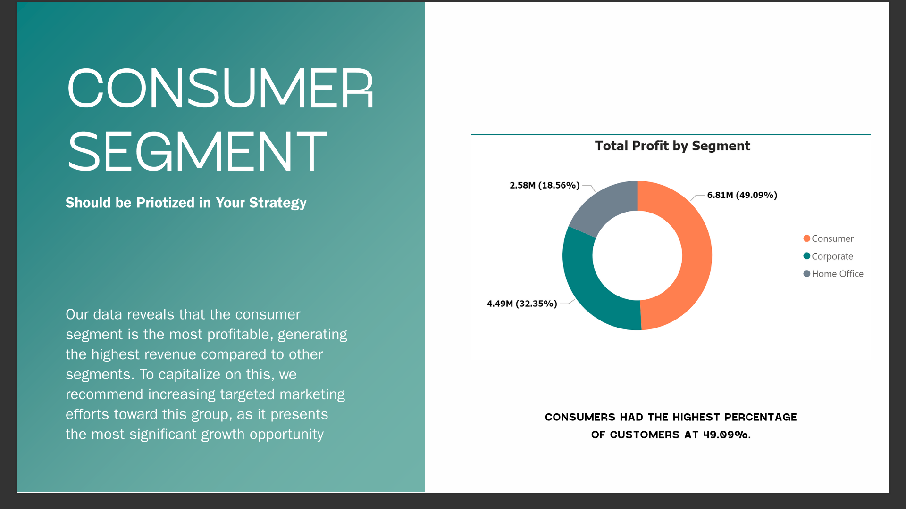

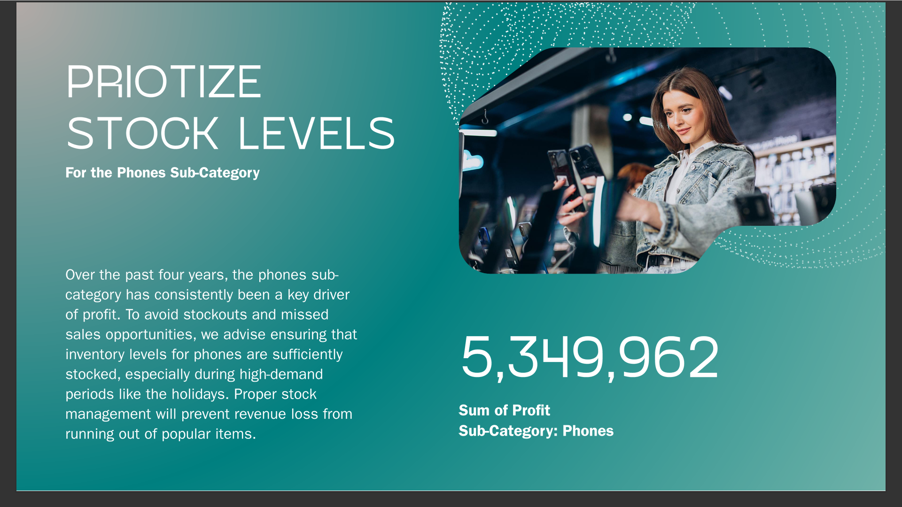

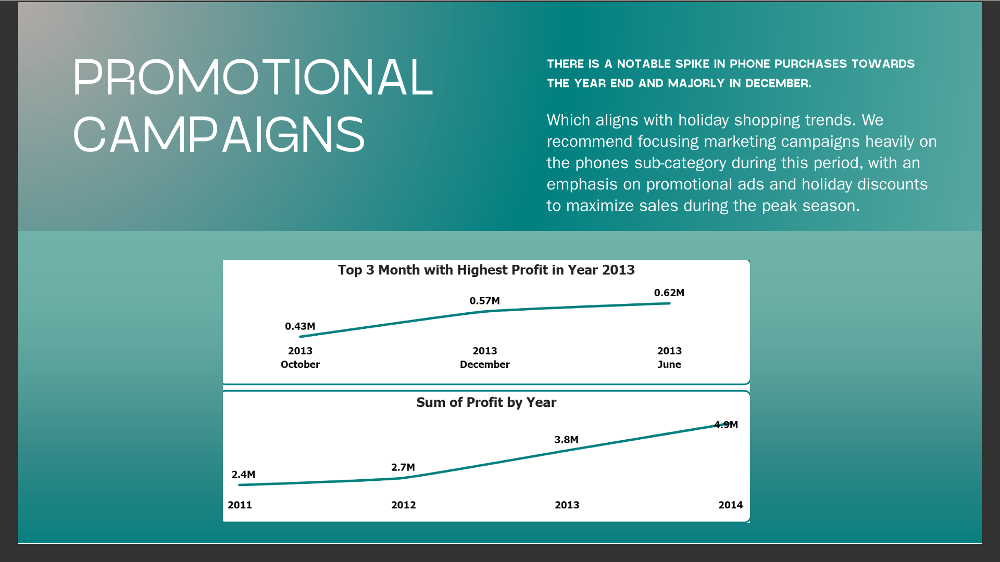

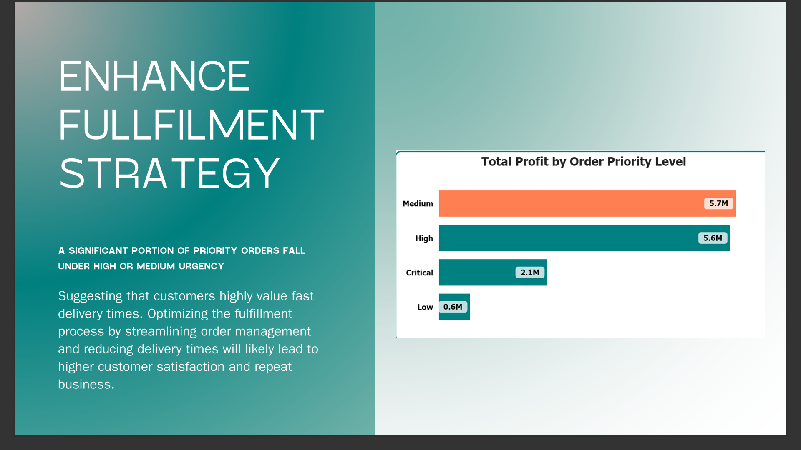

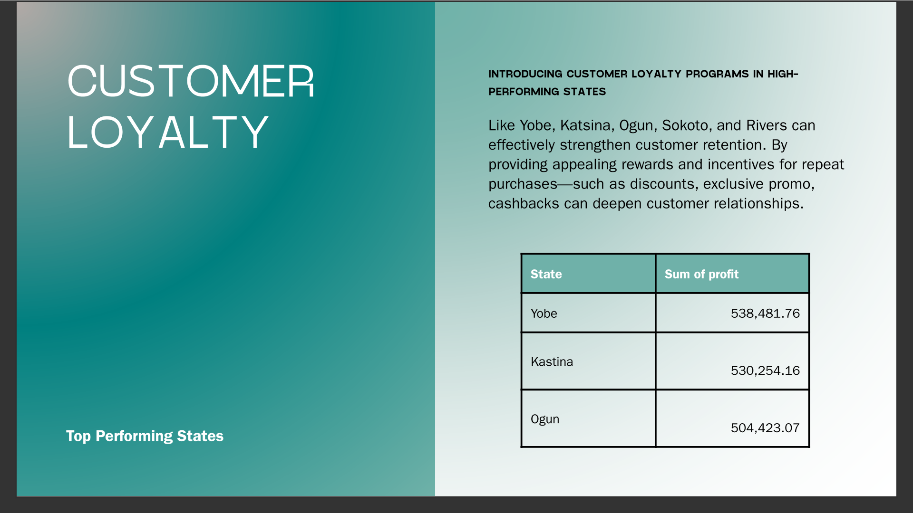

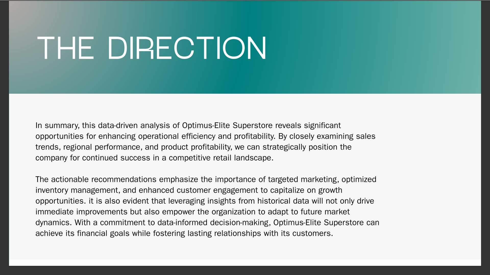

## 7.0 Recommendation
As part of the sumary gotten, it was recommended that the consumer segment is the most profitable, generating the highest revenue compared to other segments. To capitalize on that it was said that Optimus-Elite Superstores should increase targeted marketing efforts towards this group as it presents the most significant growth opportunity. 
More recommendations can be found in the PowerPoint Presentation. 
